<div align="center">

# Parla

Map Latin American slang across countries and languages

[![Live][badge-site]][url-site]
[![HTML5][badge-html]][url-html]
[![CSS3][badge-css]][url-css]
[![JavaScript][badge-js]][url-js]
[![Claude Code][badge-claude]][url-claude]
[![License][badge-license]](LICENSE)

[badge-site]:    https://img.shields.io/badge/live_site-0063e5?style=for-the-badge&logo=googlechrome&logoColor=white
[badge-html]:    https://img.shields.io/badge/HTML5-E34F26?style=for-the-badge&logo=html5&logoColor=white
[badge-css]:     https://img.shields.io/badge/CSS3-1572B6?style=for-the-badge&logo=css3&logoColor=white
[badge-js]:      https://img.shields.io/badge/JavaScript-F7DF1E?style=for-the-badge&logo=javascript&logoColor=black
[badge-claude]:  https://img.shields.io/badge/Claude_Code-CC785C?style=for-the-badge&logo=anthropic&logoColor=white
[badge-license]: https://img.shields.io/badge/license-MIT-404040?style=for-the-badge

[url-site]:   https://parla.neorgon.com/
[url-html]:   #
[url-css]:    #
[url-js]:     #
[url-claude]: https://claude.ai/code

</div>

---

## Overview

Search any Latin American slang word and instantly see its equivalents across Chile, Colombia, Argentina, Mexico, Peru, and Venezuela in a visual diagram. Words that mean the same thing across countries get grouped together, making it easy to spot regional patterns.

**Live:** parla.neorgon.com

---

## Features

- **Visual word map** -- search a term and see all equivalents connected in a radial diagram
- **6 countries** -- Chile, Colombia, Argentina, Mexico, Peru, Venezuela
- **4 categories** -- greetings, insults, adjectives, work slang
- **Country filters** -- narrow results to one country at a time
- **English search** -- search by English meaning to discover slang you don't know yet
- **Browse mode** -- explore the full dictionary grouped by category
- **Static JSON API** -- `GET /api/v1/dictionary.json` for programmatic access
- **Dotted map background** -- floating country outlines as subtle visual texture

---

## API

The full dictionary is available as a static JSON endpoint:

```
GET https://parla.neorgon.com/api/v1/dictionary.json
```

Returns all concepts with variants per country, English meanings, and categories.

---

## Running locally

ES modules require an HTTP server (not `file://`):

```bash
python3 -m http.server
```

---

## Architecture



```
parla-site/
├── index.html              # App shell
├── css/style.css           # All styles, diagram, floating background
├── js/
│   ├── app.js              # Entry point (~20 lines)
│   ├── state.js            # Search state, filters, localStorage
│   ├── data.js             # Load dictionary, search index, matching
│   ├── render.js           # DOM rendering, diagram layout, browse view
│   ├── diagram.js          # Floating background country outlines
│   ├── events.js           # Search input, filters, keyboard shortcuts
│   └── utils.js            # Helpers (escHtml, toast, debounce)
├── api/v1/dictionary.json  # Full dictionary (static JSON API)
├── data/backup.json        # Dictionary backup reference
├── CNAME                   # parla.neorgon.com
├── robots.txt              # Search engine rules
└── sitemap.xml             # Sitemap
```

---

<div align="center">
<sub>Part of <a href="https://neorgon.com/">Neorgon</a></sub>
</div>
