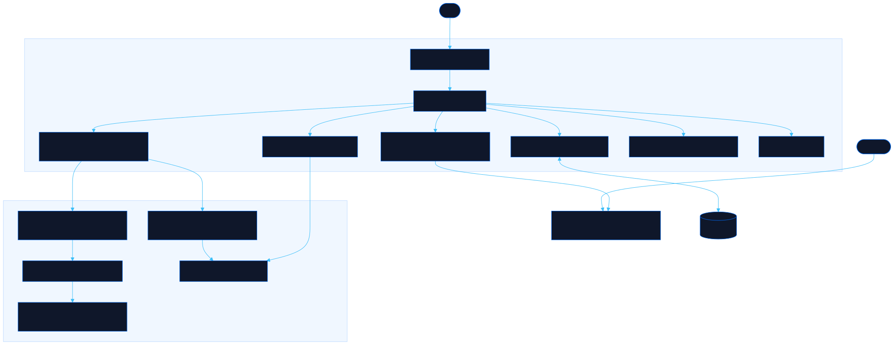

<div align="center">

# Parla

Map Latin American slang across countries and languages

[![Live][badge-site]][url-site]
[![HTML5][badge-html]][url-html]
[![CSS3][badge-css]][url-css]
[![JavaScript][badge-js]][url-js]
[![Claude Code][badge-claude]][url-claude]
[![License][badge-license]](LICENSE)

[badge-site]:    https://img.shields.io/badge/live_site-0063e5?style=for-the-badge&logo=googlechrome&logoColor=white
[badge-html]:    https://img.shields.io/badge/HTML5-E34F26?style=for-the-badge&logo=html5&logoColor=white
[badge-css]:     https://img.shields.io/badge/CSS3-1572B6?style=for-the-badge&logo=css3&logoColor=white
[badge-js]:      https://img.shields.io/badge/JavaScript-F7DF1E?style=for-the-badge&logo=javascript&logoColor=black
[badge-claude]:  https://img.shields.io/badge/Claude_Code-CC785C?style=for-the-badge&logo=anthropic&logoColor=white
[badge-license]: https://img.shields.io/badge/license-MIT-404040?style=for-the-badge

[url-site]:   https://parla.neorgon.com/
[url-html]:   #
[url-css]:    #
[url-js]:     #
[url-claude]: https://claude.ai/code

</div>

---

## Overview

Search any Latin American slang word and instantly see its equivalents across Chile, Colombia, Argentina, Mexico, Peru, Venezuela, Brazil and US Spanglish, laid out on an interactive 3D globe. Each term sits on the country that actually says it, so regional patterns are visible as geography rather than as a list.

**Live:** parla.neorgon.com

---

## Features

- **Visual word map** -- search a term and see all equivalents connected in a radial diagram
- **8 countries** -- Chile, Colombia, Argentina, Mexico, Peru, Venezuela, Brazil, and US Spanglish
- **4 categories** -- greetings, insults, adjectives, work slang
- **Country filters** -- narrow results to one country at a time
- **English search** -- search by English meaning to discover slang you don't know yet
- **Browse mode** -- explore the full dictionary grouped by category
- **Colloquial expressions** -- a second mode for the phrases a dictionary cannot help with. 71 country-specific idioms, each showing what it *sounds like* next to what it actually means, so `el que toca mano toca cara` resolves to "he is looking for a fight". Search reaches the meaning, not just the phrase
- **Usage examples** -- every word carries a short sentence showing how it is actually said, in that country's own register. Inline on the word you opened, on hover or tap for the rest
- **Static JSON API** -- `GET /api/v1/dictionary.json`, `GET /api/v1/expressions.json` and `GET /api/v1/usage.json` for programmatic access
- **3D globe** -- the whole stage. Countries are raised solids in their own colours, drag to rotate and scroll to zoom, hover one for a sample of its slang. Click a country to filter to it and open its terms; rotation is bounded so Latin America never leaves the screen, and one control returns you to all countries
- **Definitions on the map** -- opening a word pins each regional term to the country that says it, with a leader line back to the land; the camera frames exactly the countries involved
- **Works without WebGL** -- falls back to the original radial diagram; force it with `?nogl=1`

---

## API

Both data sets are static JSON endpoints:

```
GET https://parla.neorgon.com/api/v1/dictionary.json
GET https://parla.neorgon.com/api/v1/expressions.json
```

`dictionary.json` returns all concepts with variants per country, English meanings, and categories.

`expressions.json` returns country-specific idioms. Each entry carries the phrase, its `literal` surface reading, and the `meaning` that reading hides:

```json
{ "id": "dar-papaya", "phrase": "dar papaya", "country": "CO",
  "literal": "regalarle a alguien una papaya",
  "meaning": "exponerse de más y dejarle a otro la oportunidad servida de aprovecharse o robarte" }
```

---

## Running locally

ES modules require an HTTP server (not `file://`):

```bash
python3 -m http.server
```

---

## Architecture



```
parla-site/
├── index.html              # App shell
├── css/style.css           # All styles, diagram, floating background
├── js/
│   ├── app.js              # Entry point (~20 lines)
│   ├── state.js            # Search state, filters, localStorage
│   ├── data.js             # Load dictionary, search index, matching
│   ├── expressions.js      # Load, search and group the idioms
│   ├── usage.js            # Lazily loaded usage examples
│   ├── render.js           # DOM rendering, diagram layout, browse view
│   ├── diagram.js          # Re-exports background init
│   ├── globe3d.js          # Three.js globe: scene, camera, picking
│   ├── geo.js              # Sphere math + mesh builders
│   ├── overlay.js          # Term cards pinned to countries
│   ├── collide.js          # Overlap solver (shared with the fallback)
│   ├── events.js           # Search input, filters, keyboard shortcuts
│   └── utils.js            # Helpers (escHtml, toast, debounce)
├── api/v1/dictionary.json  # Full dictionary (static JSON API)
├── api/v1/expressions.json # Country-specific idioms (static JSON API)
├── api/v1/usage.json       # One usage example per variant (static JSON API)
├── data/americas.json      # Country outlines (generated, `make geometry`)
├── vendor/three/           # three.js r160 + OrbitControls (vendored)
├── scripts/build_geometry.py  # Natural Earth -> data/americas.json
├── CNAME                   # parla.neorgon.com
├── robots.txt              # Search engine rules
└── sitemap.xml             # Sitemap
```

---

<div align="center">
<sub>Part of <a href="https://neorgon.com/">Neorgon</a></sub>
</div>
