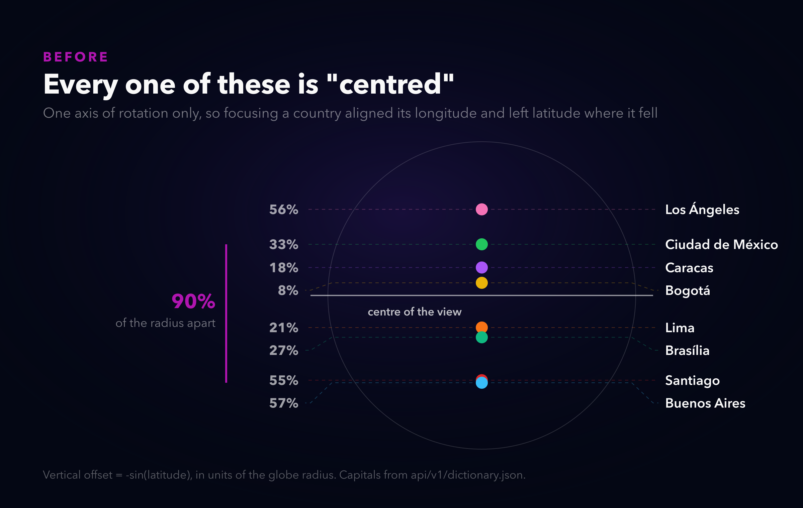
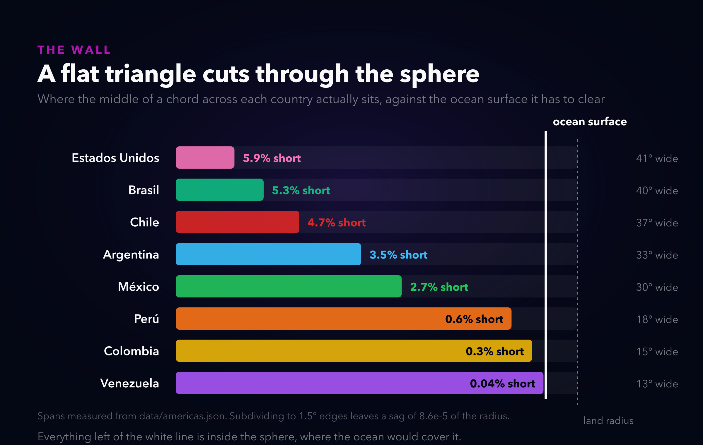
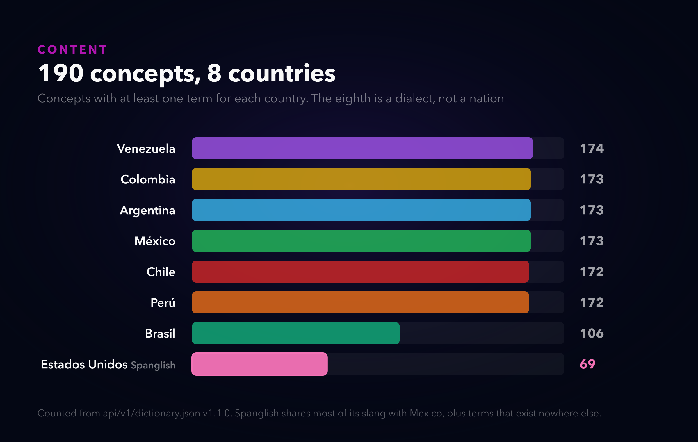

# My map was fake, and the data was real

*Alternate titles: "A diagram that can't lie about geography" · "The 90% problem" · "Every country sank"*

---

Parla is a slang map. You look up a word, it shows you what the other countries say instead. `bacán` in Chile, `chido` in Mexico, `chévere` across Colombia, Peru and Venezuela.

For months the centrepiece was a radial diagram. Word in the middle, regional variants around it. And it *felt* geographic. Mexico landed up and to the left. Brazil sat out east. Chile and Argentina hung south.

That wasn't a coincidence, and that's the part I want to talk about.

## The lie was made of real data

The angles were computed from actual capital coordinates:

```js
return Math.atan2(-(cap.lat - refLat), cap.lon - refLon);
```

Real latitudes. Real longitudes. A real bearing from a reference point near Peru. Every number in that line is honest.

And it still wasn't a map. It was a wheel with a compass bearing. Two countries at the same bearing landed on top of each other regardless of how far apart they are. Distance was thrown away and replaced with "how many countries share this word" — nodes with more countries sat further out. So a word's position encoded a bearing and a count, and the reader's eye read it as geography.

Nobody complained. It looked right. That's what bothered me.

## Meanwhile the globe couldn't centre anything

There was a globe too, sitting behind the content as decoration. It could focus a country. Except focusing only ever rotated it about one axis, so it aligned that country's **longitude** to the middle and left the latitude wherever it fell.

Which means "centred" was doing no work at all vertically.



Mexico sat a third of a radius above the middle. Argentina sat more than half a radius below it. Select either one and the app said it had centred it. They were 90% of the globe's radius apart.

So I had a diagram that implied geography it didn't have, and a globe that had geography it didn't use. The fix was to delete one of them.

## Make the globe the diagram

Now the term sits on the country that says it. Not at a derived bearing, at the projected screen position of the actual landmass, with a leader line back to it. The camera centres by longitude *and* latitude, so centring means centring.

The nice part is that this isn't a design opinion any more. It's checkable. If `chévere` is drawn somewhere other than between Colombia, Peru and Venezuela, that is a bug with a reproduction, not a taste disagreement.

## The thing that nearly broke it

You cannot draw a country on a sphere by filling in its outline. Triangulation gives you flat triangles, and a flat triangle strung across a curved surface cuts *through* it.

I assumed this would be a Brazil problem. Brazil is huge, everything else is fine, add a special case, move on.



Every single one sinks. The United States by 5.9% of the radius, Brazil 5.3%, Chile 4.7%. Even Venezuela, which is small, doesn't clear it by much. The ocean sphere would have punched straight through all eight.

The fix is to subdivide each triangle until no edge spans more than 1.5 degrees, then push every vertex out onto the sphere. That leaves a residual sag of 0.0000862 of the radius, which is sub-pixel at any zoom the camera allows.

I like this one because the naive version doesn't look broken in a way that suggests the cause. You get countries with bites taken out of them and you go looking at your triangulation, which is fine, or your z-buffer, which is also fine.

## The US question

Eight countries now, and the eighth is the United States, in as Spanglish.

That needed an answer because US Spanish isn't a country dialect in the same way. Most of it *is* Mexican slang, so most of the work was adding `US` to variants that already existed. The interesting part is the words that only live there: `la migra`, `janguear`, `la troca`, `parquear`, `wachear`, `el rufo`.

And `la carpeta`, which means carpet in US Spanish and folder everywhere else. That one's in the data with a note.



Its pin is on Los Angeles rather than Washington. Geographically arbitrary, semantically not: a Spanglish marker on the National Mall would be honest about the country and wrong about the language.

## Where this breaks

The no-WebGL fallback still uses the old radial diagram, and on a dense word it leaves two cards touching at the corners. I raised the solver's iteration count, it got better, it didn't get perfect. It's the secondary path and it's legible, so I stopped.

Rotation is capped. You can't spin the globe to look at Asia. I'd rather you can't get lost than let you find an empty ocean and no way back, but that's a call, and if it feels stiff the two numbers to change are in one place.

Reduced motion is wired but I never runtime-verified it. The code path exists and reads correctly. I didn't emulate the media query, so I'm not going to claim I tested it.

And the honest one: the old diagram wasn't broken. Nobody was misled in a way that hurt them. I rebuilt it because it was claiming something it couldn't back up, and that bugged me more than it probably should have.

---

**Live:** [parla.neorgon.com](https://parla.neorgon.com) · Geometry from Natural Earth 1:50m, public domain.
